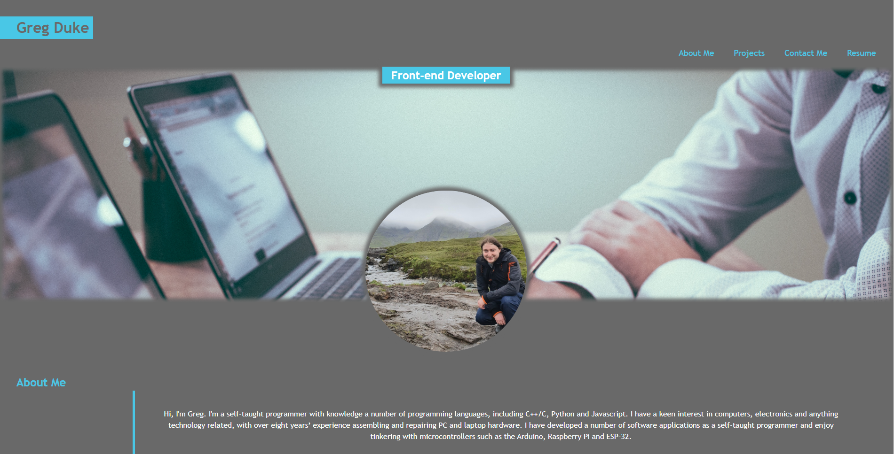
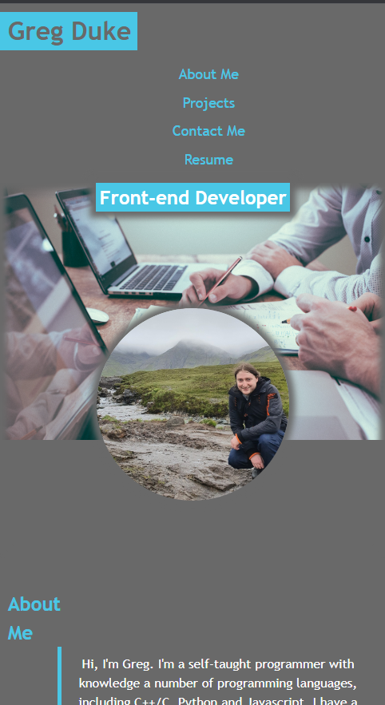

# portfolio-bootcamp-challenge

## Description
This is the second challenge assignment for the Frontend Bootcamp Course. In this challenge, I have created a personal portfolio website with a responsive design.

The website features a breif "About Me" section and showcases some of my projects.

I used the `grid` layout for the "Work"/"Projects" section, allowing me to display the images in a neat and accessable way.

Media queries make the website more user friendly by adapting the content to different screen sizes/devices.

The images below show the responsiveness of the website; note how the navbar layout changes and images are resized:

This project taught me how to effectively use CSS variables, media queries and the `grid` layout.

## Installation
N/A

## Usage
The website can be accessed via this link: https://satsumasegment.github.io/portfolio-bootcamp-challenge/

## License
N/A